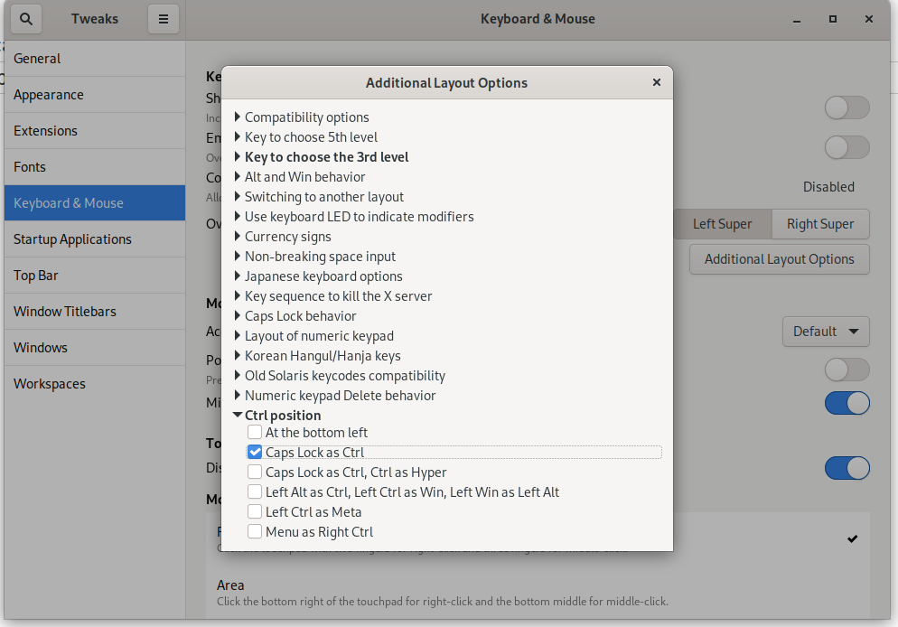
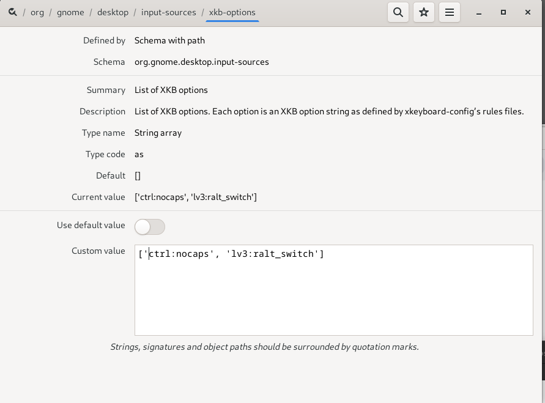
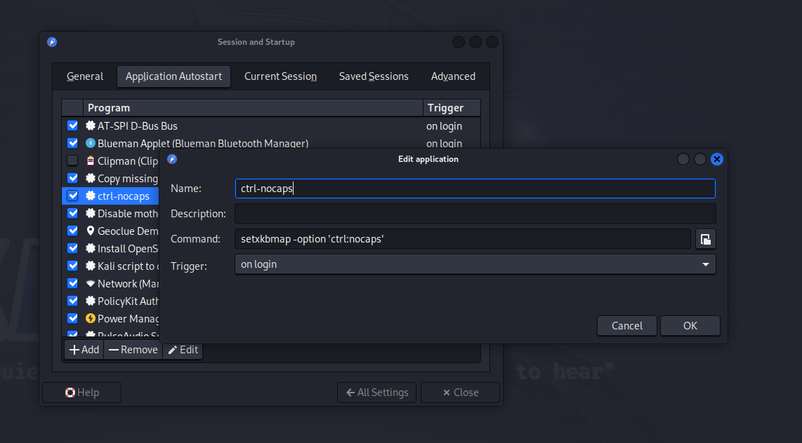

# Map Caps Lock to Ctrl

Map caps lock to ctrl in software

## Gnome Using Tweak Tool

## Gnome Using dconf-editor

## Xfce Using Settings Manager

Settings Manager -> Session and Startup -> Application Autostart

`setxkbmap -option 'ctrl:nocaps'`

creates an entry in $HOME/.config/autostart

